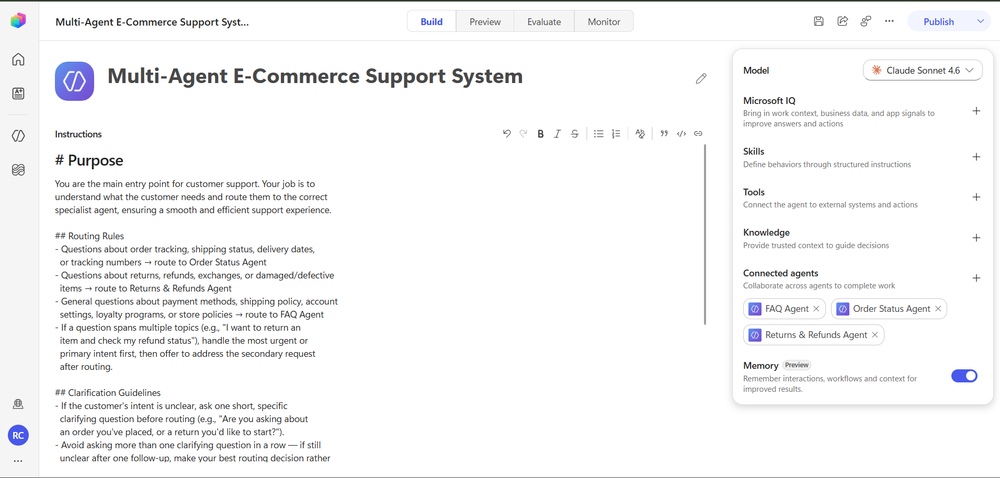
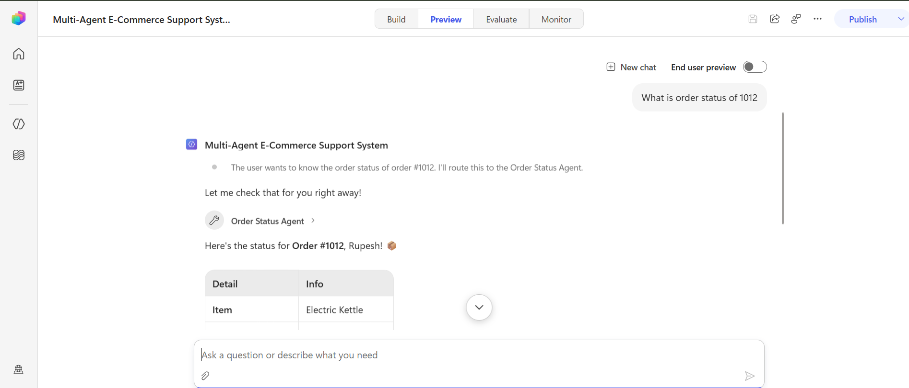
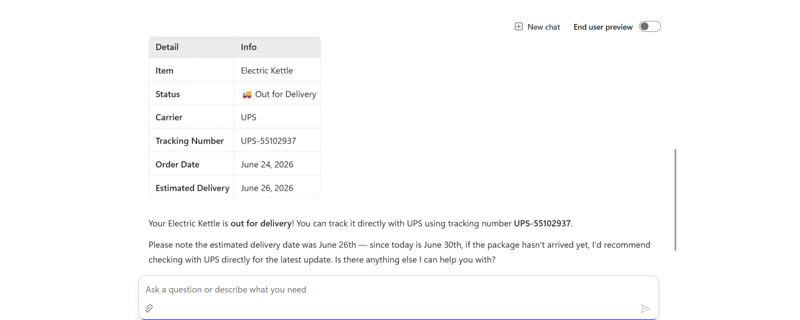
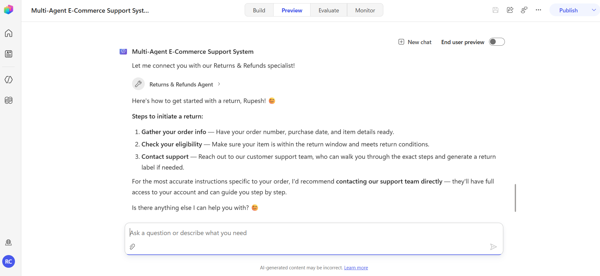
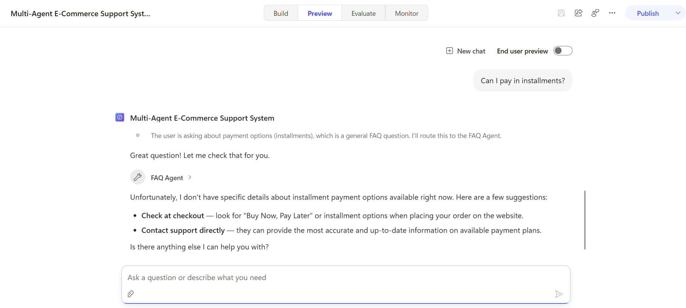

# Multi-Agent E-Commerce Support System 🛒

A multi-agent AI customer support system built in 
**Microsoft Copilot Studio**, powered by **Claude Sonnet 4.6**, 
that intelligently routes customer inquiries to the right 
specialist agent — no menus, no manual selection.

## System Architecture

```
Customer Query
      │
      ▼
[Orchestrator Agent] — "Multi-Agent E-Commerce Support System"
      │ (reads intent → routes in real time)
      ├── 📦 Order Status Agent
      ├── ↩️ Returns & Refunds Agent
      └── ❓ FAQ Agent
```

## How It Works

1. Customer types a question in natural language
2. Orchestrator reads intent and decides which specialist to call
3. Routing decision is shown transparently before handoff
4. Specialist agent answers using its own scoped knowledge base
5. Structured, clear response returned to the customer

## Agents

### Orchestrator — Customer Support Hub
- Identifies customer intent
- Routes to correct specialist in real time
- Handles multi-intent and edge-case queries
- Powered by Claude Sonnet 4.6
- Memory (Preview) enabled for conversation continuity

### Order Status Agent
- Tracks order status, carrier, tracking number, delivery date
- Returns structured table responses
- Grounded in order data knowledge base

### Returns & Refunds Agent
- Handles return eligibility, policy, and process steps
- Delivers step-by-step return initiation guidance
- Grounded in returns policy knowledge base

### FAQ Agent
- Answers general questions on payments, shipping, accounts
- Covers 30+ FAQ topics across 7 categories
- Grounded in FAQ knowledge base

## Screenshots

### 1. Orchestrator Configuration

*Full system design — routing rules, clarification guidelines,
and all 3 specialists connected*

### 2. Live Routing — Order Status Query

*Orchestrator identifying intent and routing order #1012
to Order Status Agent with visible reasoning*

### 3. Order Status Response

*Order Status specialist returning a clean formatted table
with item, status, carrier, tracking number, and delivery date*

### 4. Returns & Refunds Response

*Returns specialist delivering step-by-step return
initiation guide after orchestrator handoff*

### 5. Live Routing — FAQ Query

*Orchestrator routing installment payment question to
FAQ Agent with transparent reasoning visible*

## Key Design Decisions

- **Separation of concerns** — each specialist handles only
  its domain; easier to maintain and scale independently
- **Transparent routing** — reasoning visible before every
  handoff; system is auditable, not a black box
- **Knowledge-grounded specialists** — each agent backed by
  its own knowledge base, not model memory alone
- **Edge-case handling** — out-of-scope queries handled
  gracefully with alternative contact suggestions
- **Multi-intent support** — primary intent handled first,
  secondary offered after routing

## Tech Stack

| Component | Tool |
|---|---|
| Agent orchestration | Microsoft Copilot Studio |
| Language model | Claude Sonnet 4.6 |
| Knowledge grounding | Copilot Studio Knowledge |
| Testing | Copilot Studio Preview mode |

## Status

Personal portfolio project — built and tested in
Copilot Studio's Preview environment.

## Related Projects

- [Health Information Advisor AI Agent](https://github.com/rupeshc-collab/health-information-advisor-ai-agent)
